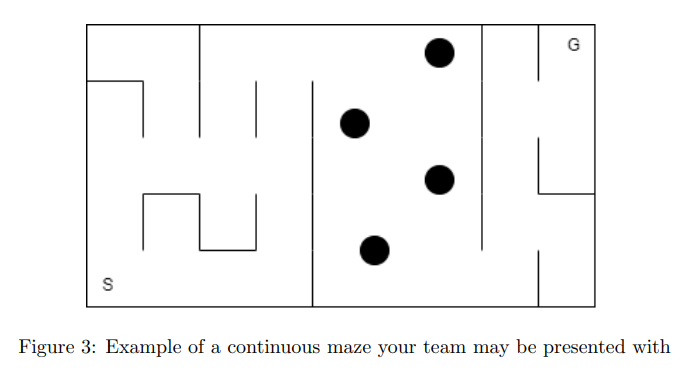

# micromouse
MTRN3100 Micromouse

## Tasks Tasks + Delegation
    
    Justin:
    - Task 4.1.1 - Grid map solving
    - Task 4.2 - Make sure assignment 2 code works
    
    Luca
    - Accurate movements
    - Self righting with lidars during map navigation

    Tarun 
    - 4.3 Generate a map of the maze as the mouse is going though
    - Rest of 4.3

    Victor:
    - 3D print the lid
    - 4.3 - Autonomous moving with the Lidar
    - Rest of 4.3
    
## Final Task Breakdown:

### 4.1 Micromouse Race

#### 4.1.1 Path Generation 2%
This is just using Assignment 2 Dijkstra's to make a path through a grid maze 

##### Tasks
    1. Take an image of the maze
    2. Solve it (given start and goal)
    3. Generate a series of commands to send to the robot

    - Must show image output before and after

### 4.1.2 Maze Completion 8%
Using the path from 4.1.1 move the robot through the maze

##### Tasks
    1. Forward command - 100mm in the grid
    2. Turn 90 degrees command left and right 
    3. Turn the generated path from 4.1.1 into moveable code for the robot
    4. Integrate the path with movement that includes lidar wall detection

Marks based on path completion and speed - 2 tries, 1 minor collision allowed

## 4.2 - Continuous Planning - 5%
A 5*5 cell section will be included in the maze. Obstacles will be cylindrical with a diameter of 100mm. Computer vision should be used to generate an occupancy
map from the image and solve the path. It may be best to generate a list of waypoints relative to each other, which the robot can move to in series. 

##### Tasks
    1. Generate an occupancy map of the obstacles
    2. Generate a path through the maze and the obstacles
    3. Move the robot through the maze and obstances using lidar as extra

1 mark for generating an occupancy map, 2 marks for your robot making it through. 2 tries, 1 minor collision allowed

## 4.3 Autonomous Mapping - 5%
Autonomously search and generate a map of the standard maze. Navigate from start to finish and generate a map of the maze. Then navigate back to the start, solve the maze and complete a shortest path run of the maze.
Visualisation of the map must be shown with a % completion score, derived from the
number of cells the robot has visited.

2 marks for your robot making it through. 2 tries, 1 minor collision allowed

##### Tasks
    1. Use the lidar to autonomously navigate through the maze
    2. Generate a map of the maze as the mouse is going though
    3. Navigate from start to the goal (given start and goal positions) - Flood fill?
    4. From the first run, generate the shortest path
    5. Run the mouse through the shortest path!

## Lidar Sensors

**Required Library**: VL6180X by Pololu

Using Lab02 `i2c_scanner_ino`:
    
    I2C address':

    - I2C device found at address 0x29  !
    - I2C device found at address 0x3C  !
    - I2C device found at address 0x68  ! 

